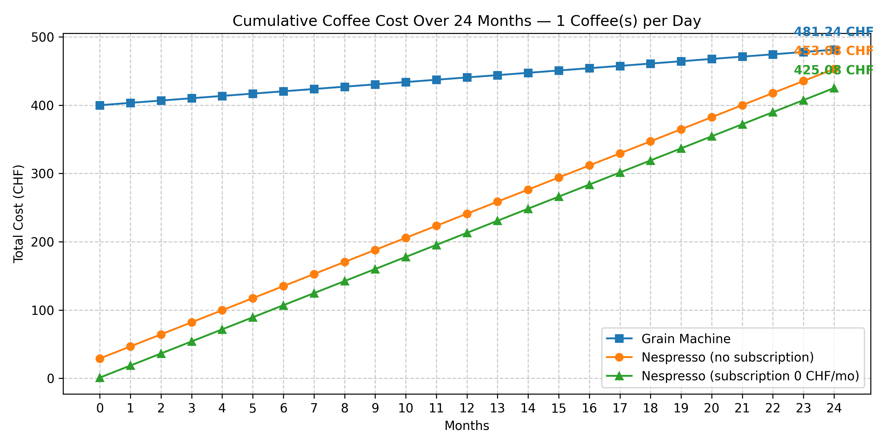
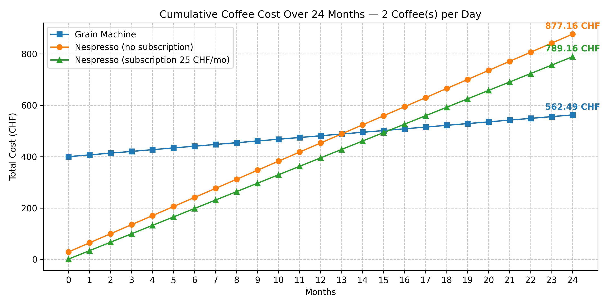
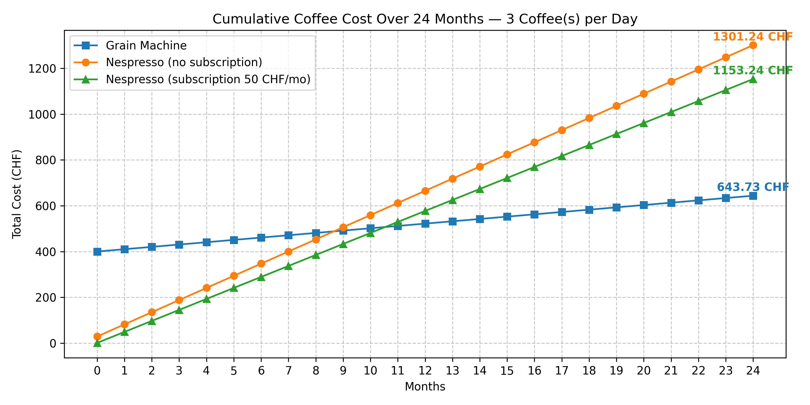

# CoffeePrices

This repository contains data analysis and cost simulations related to coffee consumption.  
It compares the **total cost of ownership** between **Nespresso systems** (with and without subscription) and **traditional coffee machines using grains** over a 24-month period.

## Project Overview

The goal of this project is to model and visualize how coffee expenses evolve depending on:
- Daily coffee consumption (1–3 coffees per day)
- Type of machine (grain vs. capsule)
- Subscription model (with or without Nespresso plan)

The analysis helps determine the **most cost-efficient choice** over time.

## Key Features

- Simulates cumulative cost over 24 months  
- Supports multiple consumption levels  
- Includes Nespresso subscription plans with monthly credits  
- Generates clear and professional Matplotlib plots  

## Requirements

Make sure you have Python 3 installed with the following package:

```bash
pip install matplotlib
```

## Example Results

Below are the cumulative cost comparisons for different daily coffee consumptions:

### 1 Coffee per Day


### 2 Coffees per Day


### 3 Coffees per Day
